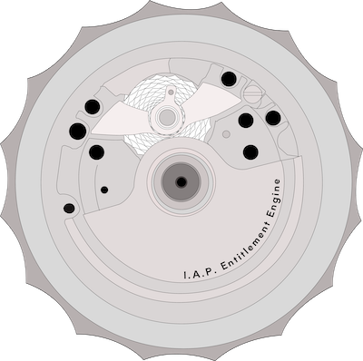

# In-App Purchase Entitlement Swift Package

## Overview

The In-App Purchase Entitlement Swift Package provides a simple and efficient way to manage in-app purchase entitlements in your iOS applications. This package helps you handle user entitlements, validate purchases, and manage subscription states seamlessly.

## Features

- Easy integration with your existing iOS app
- Support for consumable and non-consumable purchases
- Subscription management with automatic renewal handling
- Entitlement validation and verification
- Lightweight and easy to use

## Requirements

- iOS 18.0 or later
- Xcode 16.0 or later
- Swift 6.0 or later

## Installation

You can add the In-App Purchase Entitlement package to your project using Swift Package Manager. Follow these steps:

1. Open your Xcode project.
2. Go to `File` > `Swift Packages` > `Add Package Dependency`.
3. Enter the package repository URL: `https://github.com/needle-tail/iap-entitlement-engine.git`
4. Choose the version you want to install and click `Next`.
5. Complete the installation process.

## Contributing

Contributions are welcome! If you have suggestions for improvements or find bugs, please open an issue or submit a pull request.

## License

This package is licensed under the MIT License. See the [LICENSE](./LICENSE.md) file for more information.

## Contact

For any inquiries or support, please contact [support@needletails.com](mailto:support@needletails.com).

---

Feel free to modify the content to better fit your project’s functionality and your personal or organizational branding!
